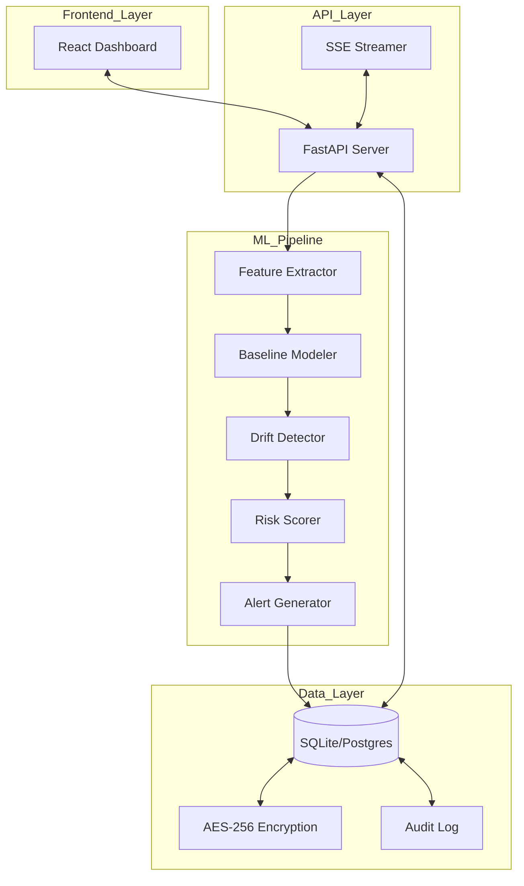

# Drishti: AI-Powered Insider Threat Detection System

Drishti is an enterprise-grade security platform designed to detect and mitigate insider threats through advanced behavioral analytics and machine learning. By analyzing user activity patterns in real-time, the system identifies anomalies and behavioral drift that may indicate malicious intent before data exfiltration or system compromise occurs.

## System Overview

The platform consists of two primary components:
1.  **Drishti API (Backend)**: A FastAPI-based service that coordinates the machine learning pipeline, manages secure data persistence, and exposes RESTful endpoints for integration.
2.  **Drishti Dashboard (Frontend)**: A React-based interface providing security analysts with real-time visualizations, threat distributions, and detailed user behavioral analysis.

## Core Architecture

The system is built on a three-layer architecture designed for security, scalability, and transparency.

### 1. Data Layer (Persistence and Security)
*   **Database**: SQLite (optimized for edge and small deployments) with support for PostgreSQL in enterprise environments.
*   **Encryption**: AES-256 encryption for sensitive behavioral data and resource identifiers.
*   **Audit Trail**: A blockchain-inspired immutable audit log for all security-critical operations and analyst actions.

### 2. Machine Learning Pipeline (Intelligence)
The analytical core consists of six integrated components:
*   **Feature Extractor**: Processes raw activity logs into a 45-dimensional behavioral feature vector covering temporal, volume, and contextual metrics.
*   **Baseline Modeler**: Utilizes the Isolation Forest algorithm to learn "normal" behavioral patterns for each user over a 30-day historical window.
*   **Drift Detector**: Employs the Mann-Kendall statistical test to identify gradual or sudden shifts in user behavior over time.
*   **Risk Scorer**: A multi-factor scoring engine that aggregates anomaly scores, drift magnitude, activity velocity, and resource sensitivity.
*   **Alert Generator**: An explainable AI (XAI) module that converts mathematical risk scores into human-readable alerts with specific risk factor breakdowns.
*   **Behavior Analyzer**: The orchestration layer that coordinates data flow between all ML components.

### 3. API Layer (Interface)
*   **FastAPI**: Provides a high-performance, asynchronous interface for the frontend.
*   **SSE (Server-Sent Events)**: Delivers real-time alert updates to the dashboard without the overhead of polling.
*   **CORS Management**: Configurable cross-origin resource sharing for secure frontend-backend communication.

## Architecture Diagram



## Deployment on Render

This project is configured for deployment on Render.com using the provided `render.yaml` blueprint.

### Backend Configuration (Web Service)
*   **Runtime**: Python 3.10
*   **Build Command**: `pip install -r requirements.txt`
*   **Start Command**: `uvicorn api.main:app --host 0.0.0.0 --port $PORT`
*   **Storage**: 1GB Persistent Disk (mounted at `/data`)

### Frontend Configuration (Static Site)
*   **Runtime**: Static
*   **Build Command**: `npm install && npm run build`
*   **Publish Directory**: `dist`
*   **API Connection**: Controlled via `VITE_API_URL` environment variable.

## Technical Specifications

| Component | Technology |
| :--- | :--- |
| Backend Framework | FastAPI (Python) |
| Frontend Framework | React (Vite, TypeScript) |
| Machine Learning | Scikit-learn, NumPy, SciPy |
| Database | SQLite with AES-256 Encryption |
| UI Components | Radix UI, Tailwind CSS |
| Visualizations | Recharts |

## Getting Started

### Local Development

#### 1. Backend Setup
```bash
pip install -r requirements.txt
python seed_database.py
uvicorn api.main:app --reload --port 8000
```

#### 2. Frontend Setup
```bash
npm install
npm run dev
```

### Deployment
1.  Push the repository to GitHub.
2.  Connect the repository to Render.com.
3.  Apply the blueprint from `render.yaml`.
4.  Run `python seed_database.py` once via the Render shell to populate the initial demo dataset.

## Security Considerations
*   All sensitive resource identifiers are encrypted at rest.
*   The system uses PBKDF2 with 100,000 iterations for key derivation.
*   Immutable audit logging ensures analyst accountability.


